# 1. Overview

Our app is a **unified** coupon wallet that brings together all of a user's coupons into one simple, easy-to-use dashboard. It helps users see both coupons they already own and relevant public offers in a single place. The app has read-only access, which means it does not change or edit any coupons. This improves coupon discovery, timely usage, and overall redemption for all partners.

# 2. The Problem Today

- Coupons are scattered across many apps, emails, SMS, and websites, making them hard to track.
- Users often forget they have a coupon or miss the expiry date.
- Partners lose potential redemptions, see lower engagement, and get less value from their coupon programs.

# 3. What Types of Coupons Are Supported

- User-specific coupons  
  - Personalized offers linked to a specific user account, wallet, or profile.  
  - Examples: app-specific reward coupons, bank wallet offers, membership vouchers.
- Public coupons  
  - Generic offers that anyone can use, typically published on coupon platforms.  
  - Examples: coupons from aggregators like GrabOn and CashKaro.
- MVP focus  
  - The initial version starts with public coupons only, to validate interest and engagement.

# 4. What We Are NOT Asking For

Partners do not need to share any sensitive or high-risk information. Specifically:

- No passwords or login credentials.
- No payment card numbers or bank account details.
- No transaction history or purchase details.
- No ability for our app to edit, cancel, or create coupons.
- No access beyond basic coupon information (metadata) required to display the offer.

# 5. What Data Partners Need to Share

To show coupons clearly and accurately in the unified dashboard, partners only need to share a small, well-defined set of fields in business terms:

- Coupon title  
  - Short, user-friendly name of the offer.
- Coupon code (if applicable)  
  - The exact code a user must enter at checkout; if not required, this can be left blank.
- Expiry date  
  - Date until which the coupon is valid, so users can see what is currently usable.
- Eligibility conditions  
  - Simple description of who can use it and under what conditions (for example, "new users only" or "minimum order amount applies").
- Category  
  - High-level grouping such as food, travel, fashion, entertainment, or payments.
- Brand / platform name  
  - Name of the app, wallet, bank, or platform that is providing or hosting the coupon.

# 6. User Consent & Trust Model

- Users give explicit opt-in consent before any of their coupons are shown in our app.
- Users choose which platforms or sources they want to connect or view.
- Access is read-only, focused purely on displaying available coupons and their status.
- Users can revoke access or disconnect a source at any time from within our app.
- Coupon information is stored in an encrypted and privacy-conscious way to protect user trust.

# 7. How Data Sharing Can Work (High-Level)

The data-sharing approach is designed to be flexible and low-effort for partners:

- Push-based sharing  
  - Partners can send updated coupon information at a frequency that suits their operations (for example, new offers, changes, or expiries).
- Hybrid future approach  
  - Initial one-time sharing of current coupons, followed by periodic updates for changes, new launches, or removal of expired offers.
- Flexibility for partners  
  - The exact process and cadence can be adapted to each partner's internal workflows, with a focus on minimizing effort and disruption.

# 8. What Changes Are Required on Partner Side

- No app, website, or user journey redesign is required.
- Coupons, offers, and campaigns already exist in partner systems and marketing plans.
- The only change is a lightweight, structured sharing of existing coupon information so it can also appear in our unified dashboard.

# 9. How Coupons Appear in Our App

- Central dashboard  
  - Users see all their relevant coupons from different brands in one place.
- Status indicators  
  - Coupons are shown as Active, Expired, or Redeemed to avoid confusion and clutter.
- Expiry reminders  
  - Gentle alerts help users use valuable coupons before they expire, which increases redemption.
- Deep links  
  - Where available, users can tap to go directly to the partner's app or website to apply the coupon and complete the transaction.

# 10. MVP Scope

- Initial focus on public coupons only, without needing user account connectivity.
- Public coupons from coupon platforms such as GrabOn and CashKaro are included.
- This phase is designed to validate demand, user engagement, and the impact on redemptions before expanding deeper into user-specific coupons.

# 11. Why Partner Early

Early partners benefit directly from being part of the unified coupon experience:

- Higher coupon redemption as users can discover and use offers more easily and on time.
- Better visibility as partner coupons sit alongside other brands in a single, high-intent dashboard.
- Improved customer satisfaction because users feel in control of their savings and offers.
- Early influence on the product roadmap, including prioritization of new features that matter most to key partners.

# 12. Data Ownership & Privacy

- Each coupon ultimately belongs to the user, who decides where it is visible and how it is used.
- The partner retains full ownership of the offer, its terms, and its commercial structure.
- Our app acts only as a display and discovery layer, making coupons easier to find and redeem without changing their core rules or economics.

# 13. Simple Flow Diagram

```mermaid
flowchart LR
    %% Styling
    classDef user fill:#E3F2FD,stroke:#1E88E5,color:#0D47A1,stroke-width:1.5px
    classDef partner fill:#FFF3E0,stroke:#FB8C00,color:#E65100,stroke-width:1.5px
    classDef data fill:#F3E5F5,stroke:#8E24AA,color:#4A148C,stroke-width:1.5px
    classDef app fill:#E8F5E9,stroke:#43A047,color:#1B5E20,stroke-width:1.5px

    %% Nodes
    U["👤 User"]:::user
    P1["📱 Consumer Apps<br/>(E-commerce, Wallets, Banks, Delivery)"]:::partner
    P2["🌐 Coupon Aggregators<br/>(GrabOn, CashKaro)"]:::partner
    CD[("🎫 Coupon Data<br/>• Title<br/>• Code<br/>• Expiry<br/>• Eligibility<br/>• Category<br/>• Brand")]:::data
    IN["📥 Secure Ingestion & Normalization<br/>(Read-only)"]:::app
    DB[("🗂 Coupon Store")]:::app
    UI["📊 Unified Coupon Dashboard<br/>Active • Expired • Redeemed"]:::app

    %% Flows
    U -->|Uses| P1
    U -->|Discovers| P2
    P1 -->|Shares Coupons| CD
    P2 -->|Shares Coupons| CD
    CD --> IN
    IN --> DB
    DB --> UI
    UI -->|Views & Redeems| U
```

# 14. One-Paragraph Summary

Our app is a unified coupon wallet that gives users a single, read-only view of both public and, in future phases, user-specific coupons, helping them discover and redeem offers before they expire while driving higher engagement and redemptions for partners. By sharing only basic coupon details such as title, code, expiry, eligibility, category, and brand name, partners can integrate with minimal effort and without exposing passwords, payment data, or transaction histories. Users stay in control through explicit opt-in, revocable access, and clear deep links back to partner apps and sites for final redemption. This creates a low-risk, privacy-conscious way for consumer apps, wallets, banks, and coupon aggregators to increase visibility and usage of their existing coupon programs.